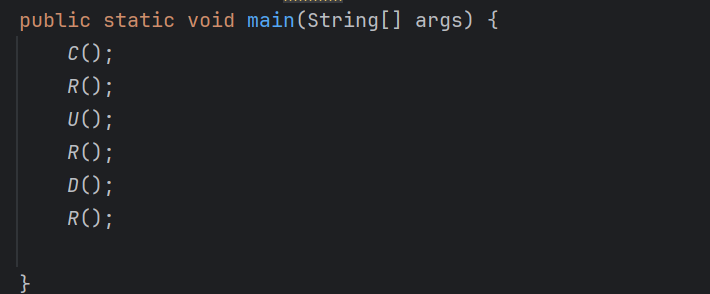

# 《实验四》  
>**学院:省级示范性软件学院**
>
> **课程:** 高级数据库技术与应用
>
>**题目:**《实验四：jdbc技术》
>
>**姓名**: 刘乐
>
>**学号**: 2200770085
>
>**班级**: 软工2204
>
>**日期**: 2024-10-30
>
>**实验环境**: jdk22，idea
##  一、实验目的
1. **完成teacher的CRUD练习，提供CRUD的代码。**
2. **完成teacher表的批量插入练习，插入500个教师，每插入100条数据提交一次。**
3. **完成可滚动的结果集练习，只查看结果集中倒数第2条数据。**
4. **提交代码即可，但是代码中不要包含taget目录。**
## 二、实验内容
1. **完成teacher的CRUD练习，提供CRUD的代码。**
    增加练习
    
    查询练习
    
    修改练习
    
    删除练习
    
    程序模块
    
    结果
    
2. **完成teacher表的批量插入练习，插入500个教师，每插入100条数据提交一次。**
    
    结果
    
3. **完成可滚动的结果集练习，只查看结果集中倒数第2条数据。**
    
    结果
    
## 三、问题及解决方法