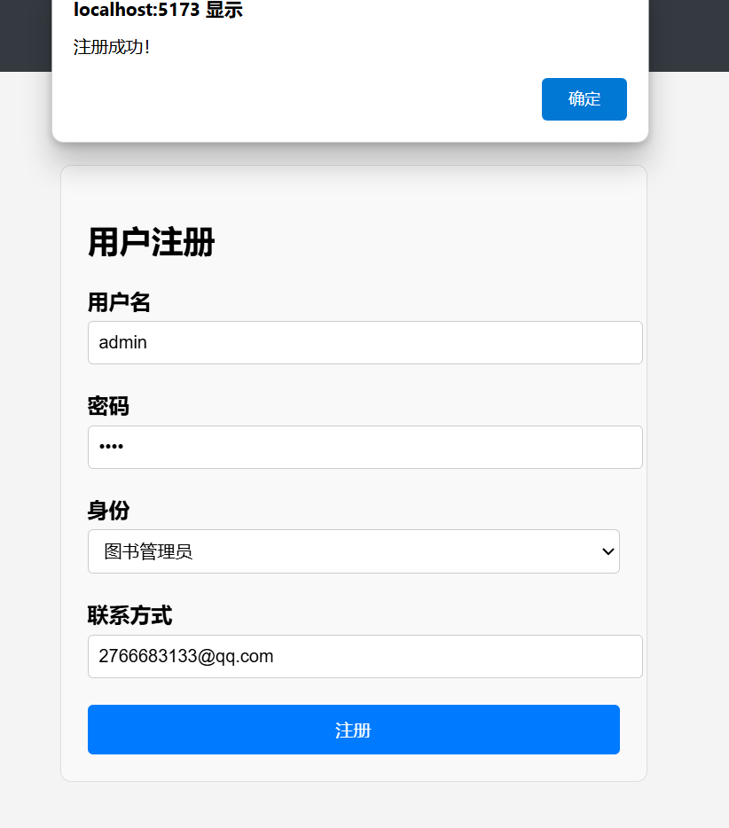

# 用户手册
#### 读者操作指南
1. 注册账号并登录系统。

2. 在首页查看图书列表、公告或使用搜索功能查找感兴趣的图书。

3. 在留言板与其他读者互动。

#### 管理员操作指南
1. 登录管理员账号。
2. 在图书管理页面对图书进行增删改查操作。

2.1 增：点击“添加图书”按钮，填写图书信息，点击“提交”按钮。

2.2 删：点击“删除图书”按钮，选择要删除的图书，点击“确认”按钮。

2.3 改：点击“修改图书”按钮，选择要修改的图书，修改信息后点击“提交”按钮。

3. 在分类管理页面操作分类。

5. 在公告管理页面发布新公告。

