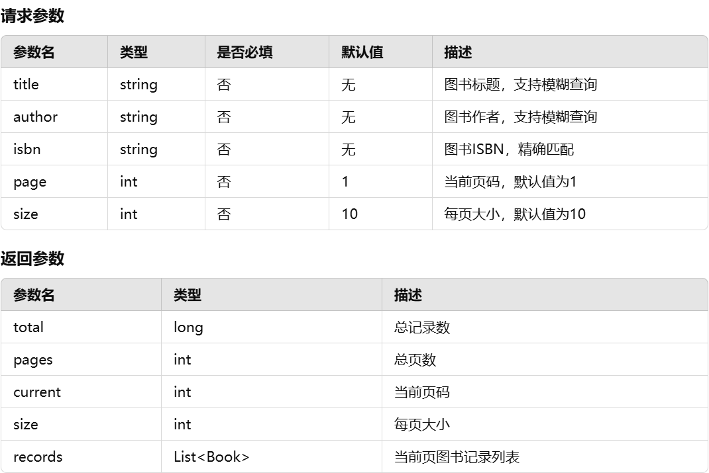

# 系统设计

### 2.1 技术选型
- **后端框架**：Spring Boot
- **持久化框架**：MyBatis-Plus
- **认证方式**：JWT
- **权限管理**：基于角色的访问控制
- **前端框架**：Vue.js

---

### 2.2 数据库设计
#### 用户表（`user`）
| 字段名       | 类型          | 说明               |
|--------------|---------------|--------------------|
| user_id      | INT        | 主键，自增         |
| username     | VARCHAR(50)   | 用户名，唯一       |
| password     | VARCHAR(100)  | 密码（加密存储）   |
| role         | ENUM('reader', 'admin') | 用户角色  |
| contact_info        | VARCHAR(100)  | 联系方式,格式校验必须为手机号或者邮箱              |


#### 图书表（`book`）
| 字段名       | 类型          | 说明               |
|--------------|---------------|--------------------|
| book_id      | INT        | 主键，自增         |
| title        | VARCHAR(100)  | 图书标题           |
| author       | VARCHAR(50)  | 作者               |
| isbn         | VARCHAR(20)   | ISBN号，格式校验为13位数字，可带-分隔符       |
| category_id  | INT        | 分类ID             |
| tag         | VARCHAR(50)  | 标签（逗号分隔）   |
| publish_date | DATE          | 出版日期           |

#### 分类表（`category`）
| 字段名       | 类型          | 说明               |
|--------------|---------------|--------------------|
| category_id           | INT        | 主键，自增         |
| category_name         | VARCHAR(50)   | 分类名称           |

#### 图书分类表（`book_category`）
| 字段名       | 类型          | 说明               |
|--------------|---------------|--------------------|
| book_category_id         | INT   | 主键自增           |
| category_id     | INT        | 外键，级联删除        |
| book_id         | INT   | 外键，级联删除           |


#### 留言板表（`message`）
| 字段名       | 类型          | 说明               |
|--------------|---------------|--------------------|
| message_id   | INT        | 主键，自增         |
| user_id      | INT        | 留言用户ID         |
| book_id      | INT        | 留言书籍ID，级联删除        |
| content      | TEXT          | 留言内容           |
| parent_id    | INT        | 父留言ID（回复时使用）|
| create_time  | TIMESTAMP     | 留言时间           |


#### 系统公告表（`announcement`）
| 字段名       | 类型          | 说明               |
|--------------|---------------|--------------------|
| announcement_id           | INT        | 主键，自增         |
| title        | VARCHAR(100)  | 公告标题           |
| content      | TEXT          | 公告内容           |
| create_time  | TIMESTAMP     | 发布时间           |

---
### 2.3.1 统一返回数据格式
```json
{
    "code": 状态码,
    "msg": "描述",
    "data": 数据对象
}
```


### 2.3.2 接口设计
#### 用户接口
| 接口名称           | 方法 | 路径             | 描述                  |
|--------------------|------|------------------|-----------------------|
| 用户注册           | POST | `/api/auth/register` | 用户注册             |
| 用户登录           | POST | `/api/auth/login`    | 登录成功返回JWT令牌，在后续的请求都要带上该令牌          |
| 用户注销           | POST | `/api/user/logout`   | 清除用户会话         |
| 查询个人信息       | GET  | `/api/user/profile`  | 获取当前用户信息      |
| 更新个人信息       | PUT  | `/api/user/profile`  | 修改当前用户信息      |


#### 图书接口
| 接口名称           | 方法 | 路径             | 描述                  |
|--------------------|------|------------------|-----------------------|
| 获取图书列表       | GET  | `/api/book/list/`        | 查询所有图书，根据请求头支持分页查询          |
| 查询图书详情       | GET  | `/api/book/{id}`   | 根据ID获取图书详情,用于获取图书基本信息     |
| 添加新图书         | POST | `/api/book/`        | 添加图书（管理员权限） |
| 更新图书信息       | PUT  | `/api/book/`   | 修改图书信息（管理员权限） |
| 删除图书           | DELETE | `/api/book/{id}`  | 删除图书（管理员权限） |
| 搜索图书           | GET | `/api/book/search/`  | 搜索图书（根据请求参数）,支持模糊搜索，支持分页 |
| 查询图书详情           | GET | `/api/book/details/{id}`  | 根据id获取图书详情，包括读者对该书的留言 |

##### 搜索图书接口补充说明



#### 分类接口
| 接口名称           | 方法 | 路径             | 描述                  |
|--------------------|------|------------------|-----------------------|
| 获取分类列表       | GET  | `/api/category/` | 查询所有分类          |
| 添加新分类         | POST | `/api/category/` | 添加分类（管理员权限） |
| 删除分类         | DELETE | `/api/category/{id}` | 删除分类（管理员权限） |
| 获取该分类的图书    | GET | `/api/category/{categoryId}` | 获取该分类所有图书 |
| 获取图书的分类   | GET | `/api/category/book/{bookid}` | 获取该图书的分类 |
| 为图书添加分类   | POST | `/api/category/book/` | 给图书添加分类(管理员权限) |
| 为图书删除分类   | DELETE | `/api/category/book/` | 给图书删除分类(管理员权限)，数据是bookId和categoryId |


#### 留言板接口
| 接口名称           | 方法 | 路径                 | 描述                  |
|--------------------|------|----------------------|-----------------------|
| 获取留言列表       | GET  | `/api/message/list`       | 查询该留言的子留言列表，支持分页查询          |
| 获取子留言列表       | GET  | `/api/message/{id}`       | 查询该留言的子留言列表          |
| 添加留言           | POST | `/api/message/`       | 添加新留言            |
| 删除留言           | DELETE | `/api/message/{id}` | 根据自己留言id删除自己留言（普通人权限）或者 根据id删除任意留言（管理员权限） |


#### 公告接口
| 接口名称           | 方法 | 路径                 | 描述                  |
|--------------------|------|----------------------|-----------------------|
| 获取公告列表       | GET  | `/api/announcement/list` | 查询所有公告(普通权限)          |
| 获取公告       | GET  | `/api/announcement/{announcementId}` | 根据id获取公告（普通权限）          |
| 发布公告           | POST | `/api/announcement/` | 添加公告（管理员权限） |
| 修改公告           | PUT | `/api/announcement/` | 修改（管理员权限） |
| 删除公告           | Delete | `/api/announcement/{annouuncementID}` | 删除公告（管理员权限） |


---

### 2.4 权限设计
- **读者权限**：
  - 查看图书信息。
  - 搜索图书。
  - 留言功能。
- **管理员权限**：
  - 所有读者权限。
  - 管理图书和分类。
  - 删除所有留言。
  - 发布公告。

## 后端架构设计
2. 后端架构设计
### 2.1 控制层（Controller）
控制层负责接收前端请求，解析请求参数，并调用服务层（Service）处理业务逻辑。最终，控制层会将处理结果封装成响应，返回给前端。

- 用户控制器（UserController）：处理用户注册、登录、信息更新等请求。
- 图书控制器（BookController）：处理图书的CRUD操作、图书分类、标签操作。
- 留言板控制器（MessageController）：处理留言的增删改查操作。
- 公告控制器（AnnouncementController）：处理公告的发布和查询。
- 分类控制器（CategoryController）：处理图书分类的增删改查。

### 2.2 服务层（Service）
服务层负责实现业务逻辑，调用数据访问层（DAO）进行数据操作，处理业务流程并进行事务控制。

- 用户服务（UserService）：负责用户的业务逻辑，如注册、登录、个人信息管理等。
- 图书服务（BookService）：负责图书的业务逻辑，如图书的增删改查、图书分类和标签管理。
- 留言板服务（MessageService）：负责留言的业务逻辑，如添加、删除、查询留言等。
- 公告服务（AnnouncementService）：负责公告的发布和查询。
- 分类服务（CategoryService）：负责图书分类的增删改查。

### 2.3 数据访问层（DAO）
数据访问层负责与数据库进行交互，利用 MyBatis-Plus 对数据库进行操作，实现常见的 CRUD 操作。

- UserMapper：用户表的数据库操作。
- BookMapper：图书表的数据库操作。
- MessageMapper：留言表的数据库操作。
- AnnouncementMapper：公告表的数据库操作。
- CategoryMapper：分类表的数据库操作。

### 2.4 权限管理
角色与权限：每个用户有一个角色，角色与具体权限（如操作图书、留言、发布公告等）绑定。
Spring Security：使用 Spring Security 实现基于角色的权限控制，结合 JWT 实现无状态的认证。
JWT：用于存储用户的认证信息，在每次请求时传递 JWT token，后端通过解析 token 验证用户身份。

### 2.5 数据库设计（MySQL）
- 用户表（users）：存储用户信息，如用户名、密码、角色等。
- 图书表（books）：存储图书信息，如标题、作者、ISBN等。
- 分类表（categories）：存储图书分类。
- 留言表（messages）：存储留言内容、用户ID等。
- 公告表（announcements）：存储公告信息。
- 图书分类表（book_categories）：存储图书与分类的关系。

