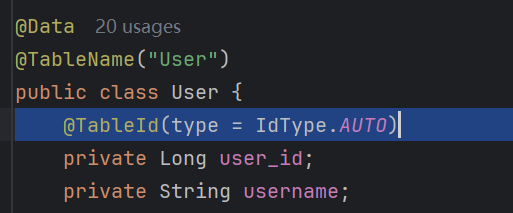
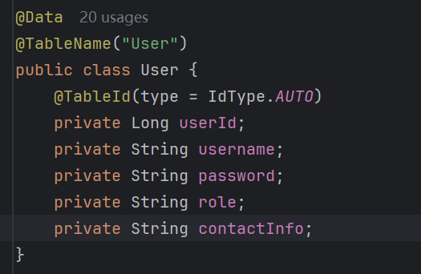
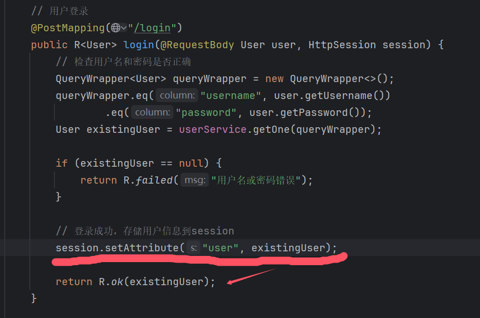
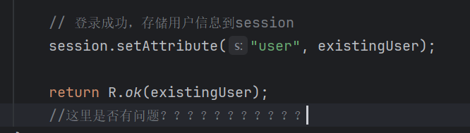
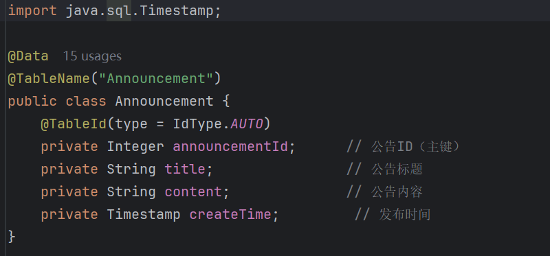
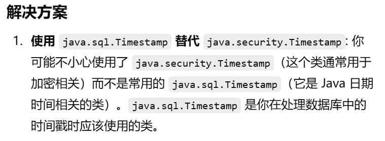
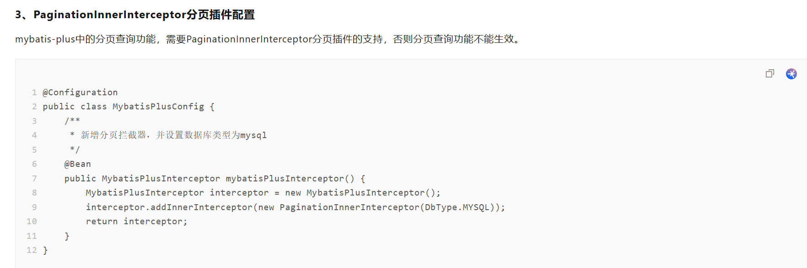
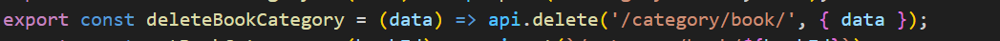

# 遇到的错误

注册的时候不需要插入id
所以要用 @TableId(type = IdType.AUTO)

实体类的属性默认要为驼峰名，才能匹配，而不是跟表名一样的user_id
要不然返回为null

`为了保持与用户的交互，登录成功是否应该返回token（session的id？）`

springmvc注解配置匹配路径时是完全匹配
以下两个是完全不一样的东西

在处理实体类的时候注意Timestamp的使用是用的java.sql库的

不能忘记配置分页

delete方法设置请求体比较特殊
错误示范

正确示范

